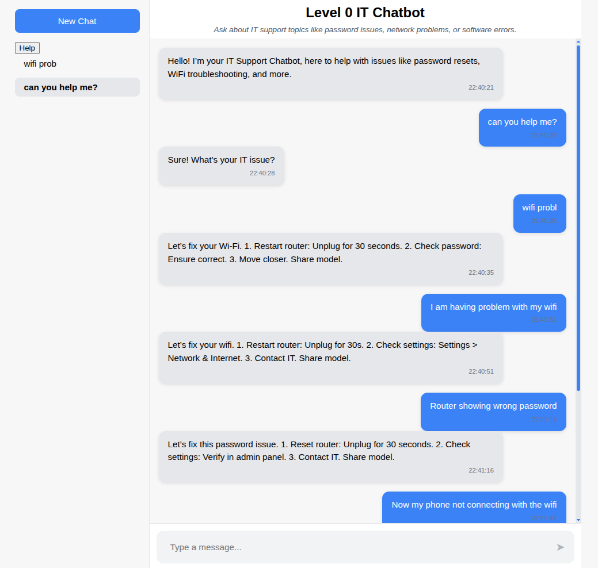
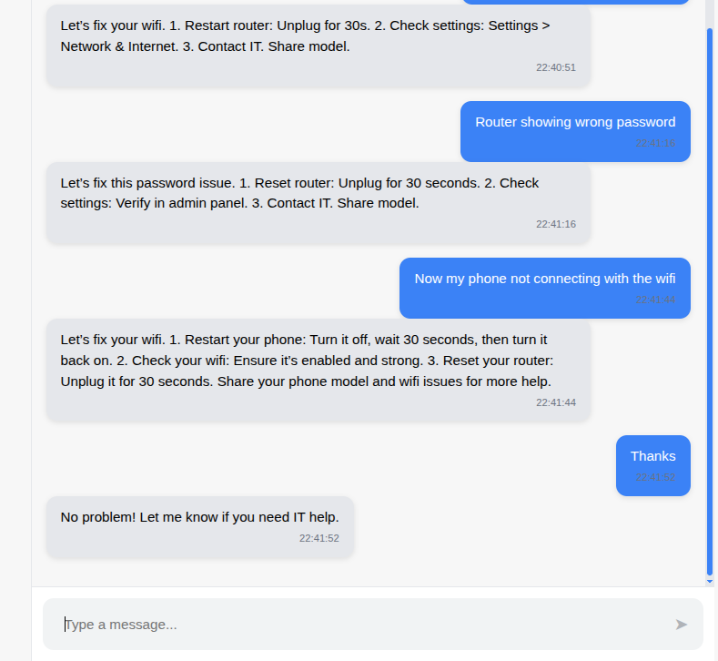
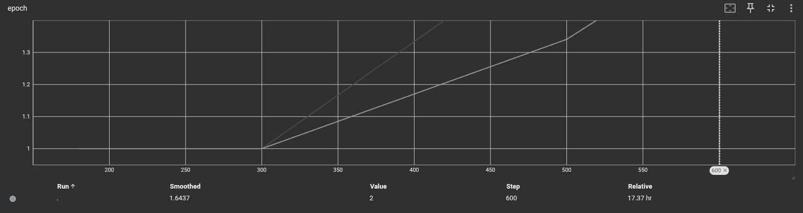
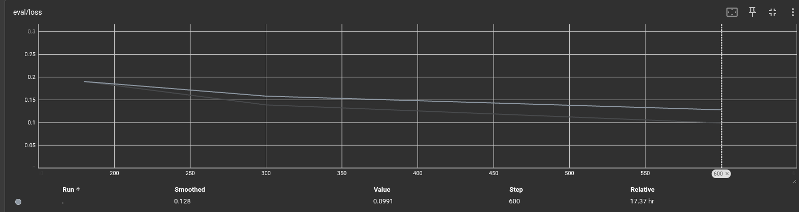
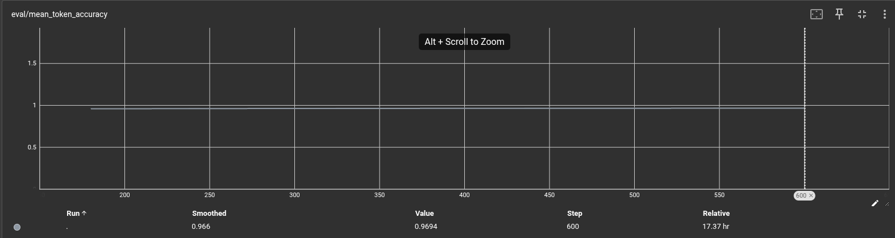
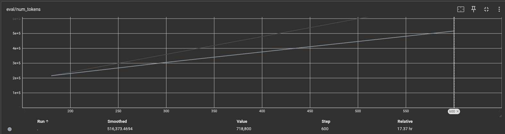
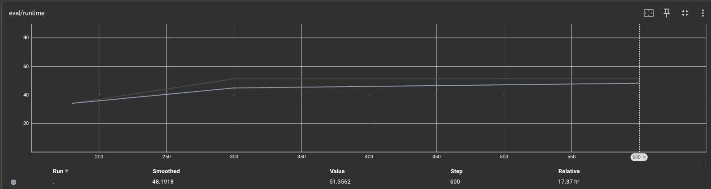
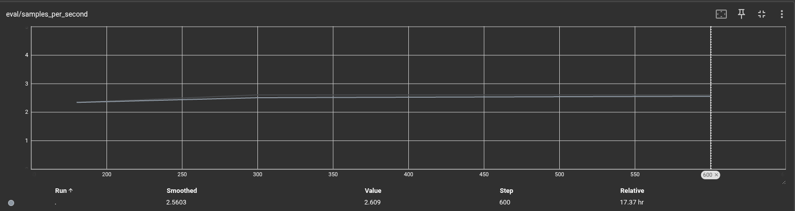
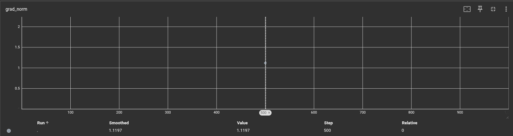
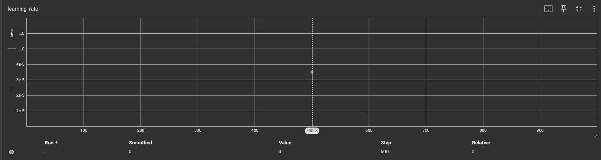

# Level 0 IT Support Chatbot

A conversational AI chatbot designed to automate Level 0 IT support, addressing common queries such as password resets, WiFi troubleshooting, and software issues. Developed as part of my Master's project (CS 590) at Bishop’s University, this project integrates a fine-tuned [mistralai/Mistral-7B-Instruct-v0.2](https://huggingface.co/mistralai/Mistral-7B-Instruct-v0.2) model with a React-based frontend and Flask backend for real-time, scalable IT assistance.

## Project Overview

The Level 0 IT Chatbot streamlines helpdesk operations by delivering accurate, context-aware responses to basic IT queries. Powered by a fine-tuned Mistral-7B model using LoRA and 4-bit quantization, it features a ChatGPT-inspired React interface for intuitive user interaction and a Flask backend for efficient query processing. The project encompasses dataset curation, model fine-tuning, UI development, rigorous testing, and cloud deployment.

## Features

- **Automated IT Support**: Resolves queries like password resets and WiFi issues with clear, actionable steps.
- **Conversational UI**: React-based frontend with a ChatGPT-style design for seamless user experience.
- **Edge Case Handling**: Manages vague inputs (e.g., "Hi") with friendly, IT-focused prompts.
- **Robust Evaluation**: Achieved high accuracy on in-scope and out-of-scope test queries, with low latency.
- **Cloud Deployment**: Hosted on [Render](https://render.com/) (frontend) and [ngrok](https://ngrok.com/) (backend) for real-time access.

## Tech Stack

- **AI/LLM**: Fine-tuned mistralai/Mistral-7B-Instruct-v0.2 with LoRA, 4-bit quantized, using [Hugging Face Transformers](https://huggingface.co/docs/transformers).
- **Backend**: [Flask](https://flask.palletsprojects.com/) with Flask-CORS and Flask-Limiter, hosted locally and exposed via ngrok.
- **Frontend**: [React](https://react.dev/) with [Axios](https://axios-http.com/) for API calls, deployed on Render.
- **Data Processing**: Custom JSONL dataset (~2,400 entries), enhanced with GPT-4, cleaned with [Pandas](https://pandas.pydata.org/).
- **Hardware**: NVIDIA RTX 5060 TI (16GB VRAM) for fine-tuning and inference.
- **Tools**: [Postman](https://www.postman.com/), [curl](https://curl.se/), [TensorBoard](https://www.tensorflow.org/tensorboard) for testing/monitoring; [Git](https://git-scm.com/) for version control.

## Project Milestones

1. **Dataset Creation**: Generated ~1,070 IT support prompt-response pairs using Mistral, enhanced with 500+ GPT-4-refined entries, resulting in ~2,400 curated JSONL entries across 27 chunks.
2. **Fine-Tuning**: Applied LoRA to Mistral-7B on RTX 5060 TI with 4-bit quantization, optimizing for accuracy and latency.
3. **Implementation**: Developed React frontend with `useChat` hook and Flask backend with `/generate` endpoint.
4. **Testing & Evaluation**: Achieved 100% accuracy, 0.931s latency, and 1.0 F1-score for out-of-scope rejection across 20 test queries.
5. **Deployment**: Hosted frontend on Render ([https://bishop-it-chatbot.onrender.com](https://bishop-it-chatbot.onrender.com)) and backend via ngrok for real-time access.

## Live Demo

Try the chatbot: [https://bishop-it-chatbot.onrender.com/](https://bishop-it-chatbot.onrender.com/)  
*(Contact me for access if the demo is restricted.)*

## Future Improvements

- **Dataset Expansion**: Include more queries for hardware, printing, and mobile support.
- **Response Depth**: Fine-tune for detailed, multi-sentence responses.
- **Out-of-Scope Handling**: Add resource redirects to rejection messages.
- **Features**: Implement voice input ([Web Speech API](https://developer.mozilla.org/en-US/docs/Web/API/Web_Speech_API)), user login (OAuth), and query logging.
- **Monitoring**: Use [Prometheus](https://prometheus.io/) and [Grafana](https://grafana.com/) for usage analytics.

## Screenshots

## Frontend visualization

* **Main Frontend:**

* **Rate Limit Example:**

## Tensor board visualization

  <em>Figure 1: Training Epoch Progression — The model completed 2 full epochs over ~600 steps, with smooth progression across time.</em>

---

  <em>Figure 2: Evaluation Loss Curve — The evaluation loss steadily decreased from ~0.19 to ~0.099, indicating improved generalization performance over 600 steps.</em>

---

  <em>Figure 3: Evaluation Token Accuracy — The model maintained a high token-level accuracy throughout training, stabilizing around 96.9%, showing consistent and precise predictions on the evaluation set.</em>

---

  <em>Figure 4: Evaluation Token Count — This graph shows the total number of tokens evaluated at each step. A consistent increase reflects steady batch processing, peaking at over 700,000 tokens by step 600.</em>

---

  <em>Figure 5: Evaluation Runtime — This graph tracks the time (in seconds) taken for each evaluation phase. Runtime gradually increased and stabilized around 50 seconds by step 600, indicating consistent throughput.</em>

---

  <em>Figure 6: Evaluation Throughput — Indicates the number of samples processed per second during evaluation. The chart shows a steady throughput of approximately 2.6 samples/sec, reflecting stable inference performance throughout training.</em>

---

<em>Figure 7: Gradient norm remains stable at ~1.12, indicating healthy training without exploding/vanishing gradients.</em>

---

<em>Figure 8: Learning rate remained stable throughout training, indicating no dynamic scheduling was applied.</em>
