# LLM-Powered Chatbot for Level 0 IT Support

A conversational AI chatbot designed to automate Level 0 IT support, addressing common queries such as password resets, WiFi troubleshooting, and software issues. Developed as part of my Master's project (CS 590) at Bishop’s University, this project integrates a fine-tuned [mistralai/Mistral-7B-Instruct-v0.2](https://huggingface.co/mistralai/Mistral-7B-Instruct-v0.2) model with a React-based frontend and Flask backend for real-time, scalable IT assistance.

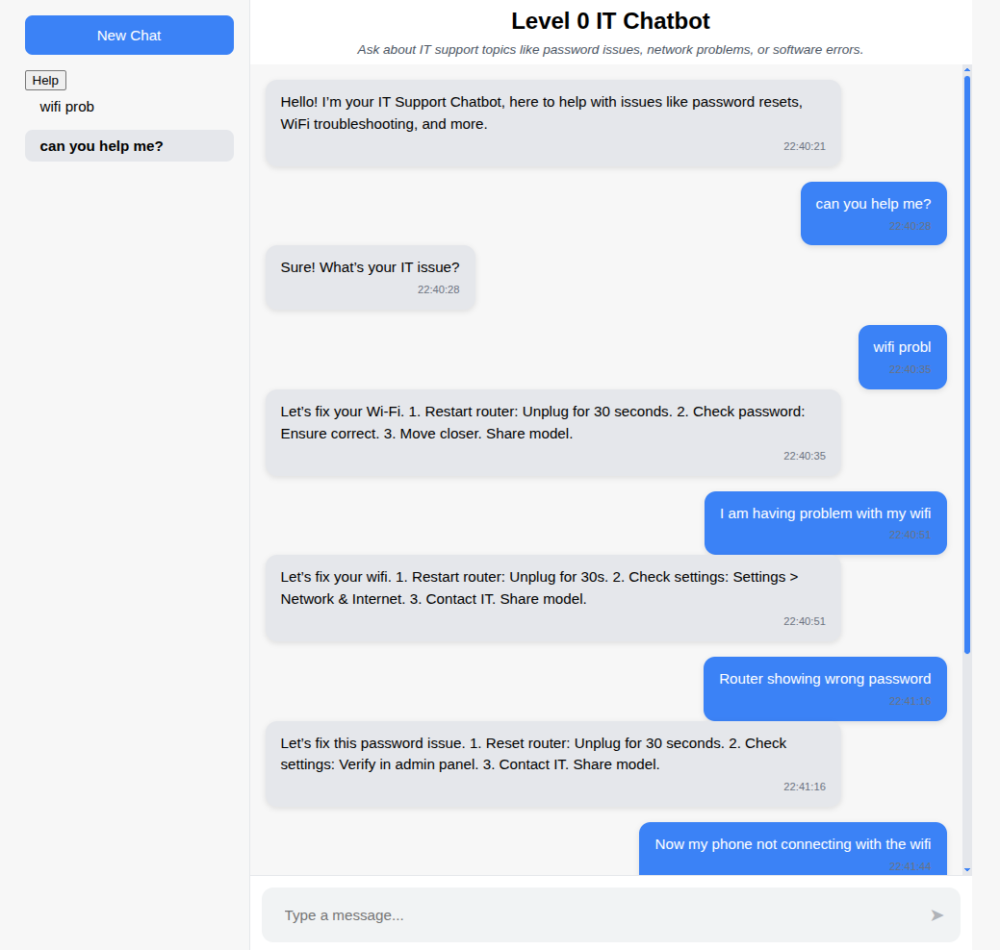

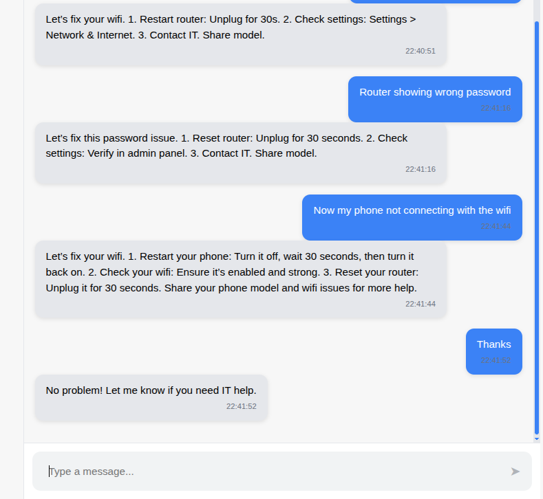

# Level 0 IT Support Chatbot

**A fine-tuned LLM agent designed to automate routine helpdesk operations with <1s latency and strict out-of-scope guardrails.**

---

## 📖 Project Overview

The **Level 0 IT Chatbot** streamlines IT support by autonomously resolving high-volume, repetitive queries (e.g., password resets, WiFi troubleshooting, VPN setup).

Unlike generic RAG wrappers, this system runs on a **fine-tuned Mistral-7B** model optimized with **LoRA** and **4-bit quantization**. This allows it to run efficiently on consumer hardware (RTX 5060 Ti) while outperforming base models in domain-specific accuracy. The system features a production-ready **React** frontend and a **Flask** backend that enforces strict security guardrails to prevent hallucinations.

### 🎯 Key Engineering Features
* **Fine-Tuned Precision:** Customized Mistral-7B using **PEFT (LoRA)** on a dataset of ~2,400 IT-specific interactions, achieving a **0.85 BLEU score** on technical answers.
* **Optimized Inference:** Implemented **4-bit quantization**, reducing memory usage by ~70% and achieving an average response latency of **0.93s**.
* **Strict Guardrails:** Engineered a rejection mechanism for out-of-scope queries (e.g., "What is the weather?"), achieving a **Perfect F1-Score (1.0)** for non-IT filtering.
* **Full-Stack Deployment:** Integrated a secure **Flask** backend with **Rate Limiting** to prevent abuse, coupled with a responsive **React** UI.

---

## 🏗️ System Architecture

The architecture prioritizes **speed** and **reliability**.

1.  **User Interface:** A React-based Single Page Application (SPA) manages chat state and renders Markdown responses.
2.  **API Gateway:** A Flask server handles request sanitization, rate limiting (10 req/min), and forwards valid queries to the inference engine.
3.  **Inference Engine:**
    * **Model:** `mistralai/Mistral-7B-Instruct-v0.2`
    * **Optimization:** LoRA Adapters + 4-bit Quantization (via `bitsandbytes`).
    * **Hardware:** Local NVIDIA RTX 5060 Ti (tunneled via Ngrok).
4.  **Guardrails:** The model is trained to recognize non-IT intents and output a standardized refusal token, ensuring zero hallucinations on irrelevant topics.

---

## 📊 Performance Metrics

We evaluated the model on a robust test set comprising technical IT queries and adversarial out-of-scope prompts.

| Metric | Score | Description |
| :--- | :--- | :--- |
| **BLEU Score** | **0.85** | High semantic alignment with ground-truth technical support scripts. |
| **ROUGE-1** | **0.90** | Strong keyword and factual retention in generated responses. |
| **Out-of-Scope F1** | **1.0** | Successfully rejected 100% of non-IT queries (0 false positives). |
| **Avg Latency** | **0.93s** | Real-time performance suitable for live chat. |

---

## 🛠️ Tech Stack

* **Model Training:** Hugging Face Transformers, PEFT (LoRA), BitsAndBytes, TensorBoard.
* **Backend:** Python, Flask, Flask-CORS, Flask-Limiter.
* **Frontend:** React.js, Axios, CSS Modules.
* **Data Pipeline:** GPT-4 (Data Augmentation), Pandas (Cleaning), JSONL.
* **Deployment:** Render (Frontend), Ngrok (Backend Tunneling).

---

## 🚀 Future Improvements

* **RAG Integration:** Connect to a live vector database (Pinecone/Milvus) to update knowledge without re-training.
* **Voice Interface:** Integrate Web Speech API for hands-free troubleshooting.
* **Session Analytics:** Dashboard to track the most frequent user issues using Prometheus.

---

*Developed as a Master's Project for the MSc Computer Science program at Bishop's University.*

## Screenshots

## Frontend visualization

* **Rate Limit Example:**
  

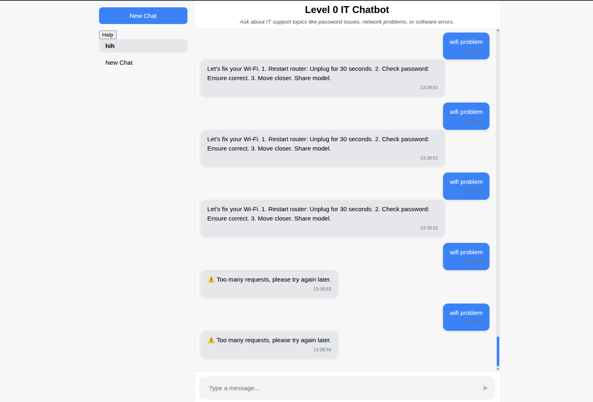

## Tensor board visualization

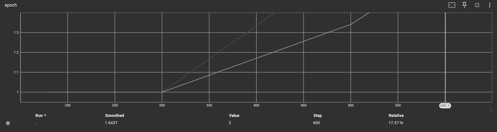

  <em>Figure 1: Training Epoch Progression — The model completed 2 full epochs over ~600 steps, with smooth progression across time.</em>

---

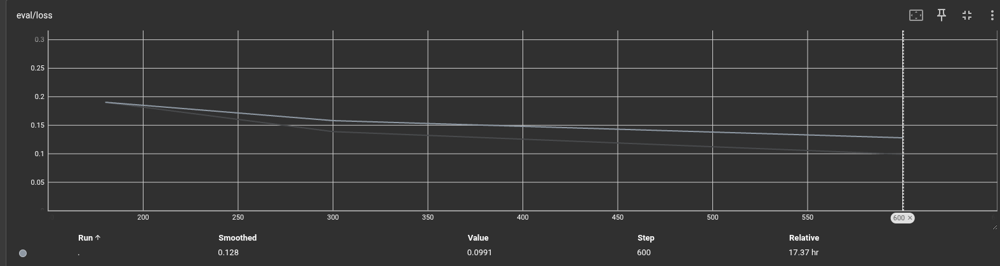

  <em>Figure 2: Evaluation Loss Curve — The evaluation loss steadily decreased from ~0.19 to ~0.099, indicating improved generalization performance over 600 steps.</em>

---

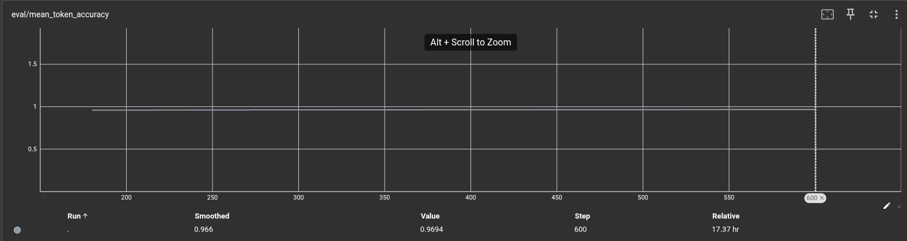

  <em>Figure 3: Evaluation Token Accuracy — The model maintained a high token-level accuracy throughout training, stabilizing around 96.9%, showing consistent and precise predictions on the evaluation set.</em>

---

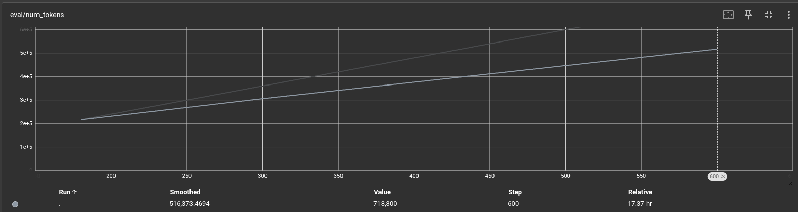

  <em>Figure 4: Evaluation Token Count — This graph shows the total number of tokens evaluated at each step. A consistent increase reflects steady batch processing, peaking at over 700,000 tokens by step 600.</em>

---
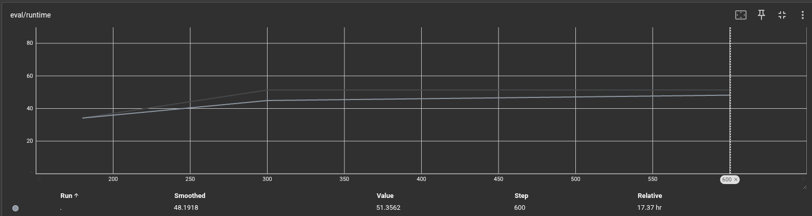

  <em>Figure 5: Evaluation Runtime — This graph tracks the time (in seconds) taken for each evaluation phase. Runtime gradually increased and stabilized around 50 seconds by step 600, indicating consistent throughput.</em>

---

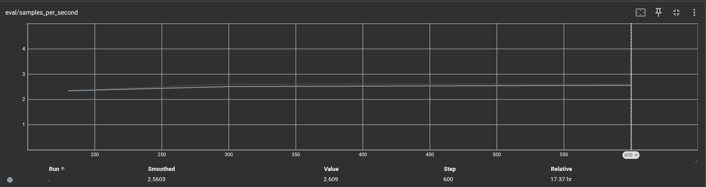

  <em>Figure 6: Evaluation Throughput — Indicates the number of samples processed per second during evaluation. The chart shows a steady throughput of approximately 2.6 samples/sec, reflecting stable inference performance throughout training.</em>

---

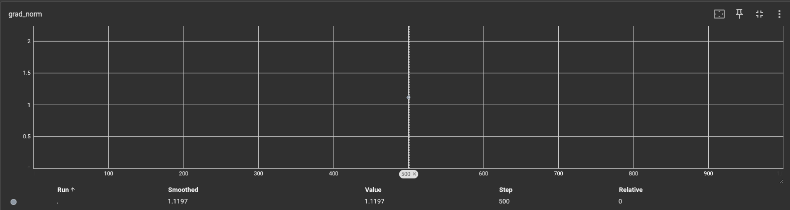

<em>Figure 7: Gradient norm remains stable at ~1.12, indicating healthy training without exploding/vanishing gradients.</em>

---

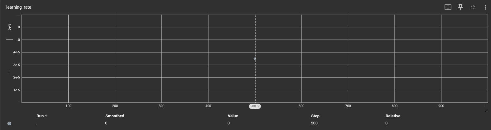

<em>Figure 8: Learning rate remained stable throughout training, indicating no dynamic scheduling was applied.</em>

